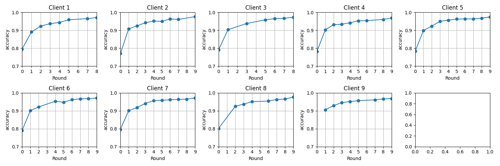
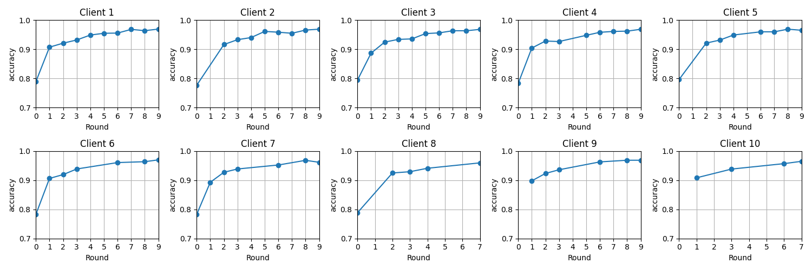
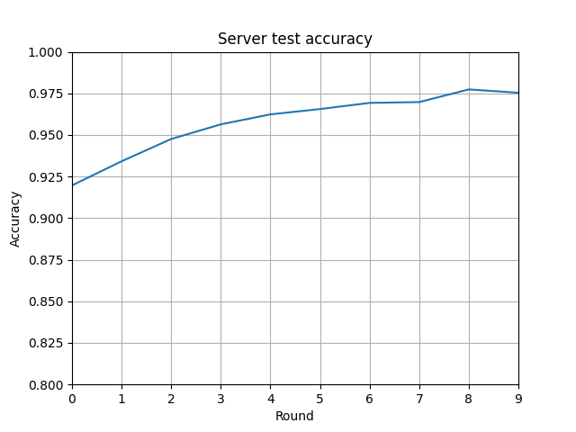
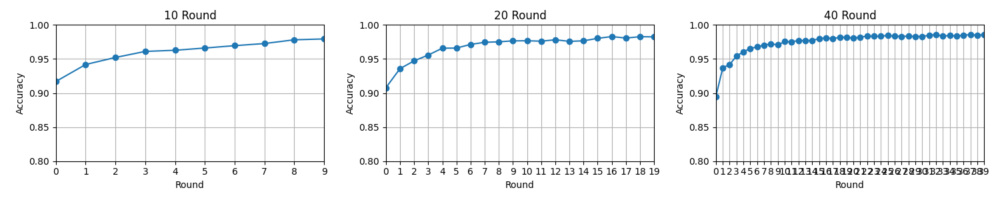
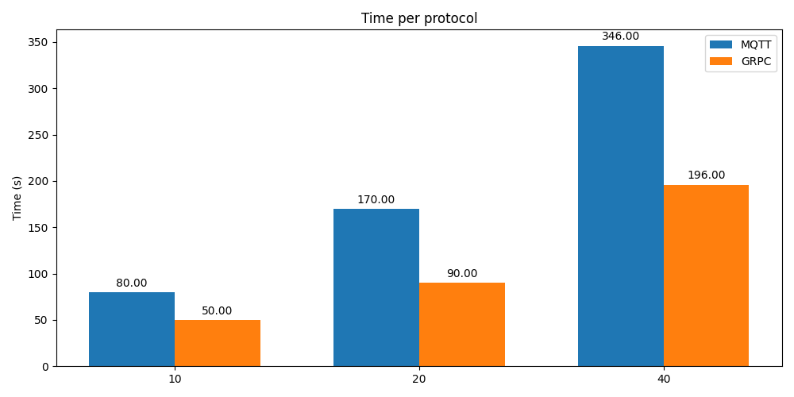

# Decentralized Federated Learning
This is a Decentralized Federated Learning implementation using the algorithm Federated Average. Video explanation can be found in this [video]() (video is in portuguese).

Implemeted by: Beatriz Maia, Iago Cerqueira & Sophie Dilhon

## Running the application
### Environment Config
The application was made using Python 3.10 and there are a few libraries that you may need to install.
It is recommended to use a virtual environment, for that you may run the following commands:

```sh
python -m venv {environment}
```

where {environment} can be any name of your choice. After creating it, it has to be activated. On Linux and Mac, use the following command:

```sh
source /{environment}/bin/activate
```

and on Windows:

```sh
.\{environment}\Scripts\activate
```

Finally, install the dependencies with

```sh
pip install -r requirements.txt
```

For communication between clients a broker is created, make sure you have Docker installed for that and run it with
```sh
docker compose up
```
The broker will be avaible on port `1883`.

### Execution

To run the clients, execute the following commands in different terminals (at least `{qtd_clients}`). 
```sh
python client.py --host {h} --port {p} --batch_size {b} --qtd_clients {k} --train_clients {n} --accuracy_threshold {a} --max_rounds {r}
```

Client flags meaning:
--port: Port on which the broker is avaible
--host: Host on which the broker is avaible
--batch_size: Batch size for training.
--qtd_clients: Number of clients connected to the broker.
--train_clients: Number of clients training per round.
--max_rounds: Maximum number of rounds.
--accuracy_threshold: Minimum accuracy threshold.


Several clients can be created, it must be at least `qtd_clients`. The flags are not obligatory, the server will use default values if no argument is passed.

## Implementation

### Communication
The communication between clients is done using the Publisher/Subscriber model (emqx mqtt broker). To stablish a connection all clients must send a `InitMsg` with their ID's. This makes them become a known client.


### Election
For this implementation, the side that is resposible for calculating the centralized federated average will be called as server, and the side responsible for training models "locally" as clients, though initially every process is a client. One client must then be elected as server, for that every known client sends a `ElectionMsg` with their vote, the biggest becomes the server.

### How it works
The server is responsible for starting and finishing training. After being elected it will start the training, sending a `TrainingMsg` containing the model weights, current round and the clients that will train ID's, as well as the training session id.

After training, each client sends a `RoundMsg` with their models weights, sample size and session id. The server reads every message and aggregates the weights calculating the federated average, where models that trained with more samples are given more importance. This can be summarized by:

    ```py
    sum(weights * local_sample_size) / sum(local_sample_size)
    ```
The server publishes an `AggregationMsg` message with the new weights, all clients (even non trainers) test the model and send an `EvaluationMsg` message with the accuracy obtained on their local data.

Finally the server analyse if the mean accuracy is equal or greater than the threshold or if the max round is reached. If none of that is applicable, a new round begins. If not, a `FinishMsg` is sent containing the word 'stop' and the training is finished. Later on a new election begins to restart the training process.

Data is divided as in [previous implementation of federated learning](https://github.com/beamaia/federated_system_mnist).

## Analysis

This analysis is done considering that 10 max trainers were used. For each round, the minimum amoun of trainers were 5, but more could be used. A total of 10 rounds were made.

In the image below, we can follow the training of the 9 different clients. The models start with a few data examples, which results in an accuracy of around 80%. Not all clients trained in the first round (or all rounds), only clients with an 'o' marker in round 0. 


We can compare this to the first project and see that this is all very similar to the result we had. One thing however is different. In the image above there are only 9 clients plotted, while the image below, referencing the first project, has 10 clients. Both experiments had 10 trainers, however the first experiment had a centralized training server that could use the 10 trainers simultaneously if needed. With a decentralized server, one of the trainers must be the training server that will be responsible for calculating the federated average, and for that reason not all of the trainers will be available to train locally. 



After the federated average is calculated and sent to the new clients in round 1, the accuracy shots up, as noticed in the first project. This shows that the usage of the algorithm helped tremendously, with an increase of 10%. This indicates that even though the clients between themselves had limited data, when calculting the average between them, it was possible to create a more accurate model. Most of this text can be observed in the first project as well, since the perfomance is very similar.

As the rounds increases, the accuracy as well, but in a slower ramp.


Analyzing the average test accuracy by the server size, we can also see this increase to the accuracy. While the training models start in rather lower percentage, the test considers the federate average calculated model, and it shows what observed in round 1 of training. Round 0 test results are already over 90%. As the rounds increases, so does the accuracy. 

Accuracy using MQQT:


Accuracy using GRPC:


Both of them have a very similar curve. The MQQT result is slightly better, but this can be most likely due to the randomness of the data, since both are around 97.5%.

Running for different of rounds, it's possible to observe how the accuracy increases, however it's not as big of an increase. The MNIST data is very simple, therefore this is expected.



This follows the same example as the usage of GRPC, as shown in the image below.


In all of these images, it's really hard to pin point different results in terms of perfomance. They are all using the same algorithm, with once again, the only difference is the max numbers of trainers that they can use during training. 

One thing that we can also observe is time and computational power. CPU and RAM was not measured, so this is based on mostly personal experience. This situation is very hypothetical, where we simulate 10 clients locally, in one computer. In real life, these clients would be in different devices, with different computacional powers, and we wouldn't have to run all of the processes on one server. Using GRPC was noticebly taxing, with the computer being unable to do any other activity other than train the models. If we tried using other programs, the computer was significantly slow and would sometimes crash. This however, did not happen when using MQQT. 

Despite this obvious behaviour in terms of slowing down the computer, where MQQT had a better behaviour than GRPC, in terms of time it was slightly slower. However, once again, we are running locally in a hypothetical situationl, so latentcy can't be properly investigated and measured. But, for comparinson, we can see in the graph that GRPC in general was quicker thant MQQT. With the amount of rounds increasing, the difference in time would almost double. We were using docker as well for the MQQT, so this is a possibility of why there is a time difference. 


